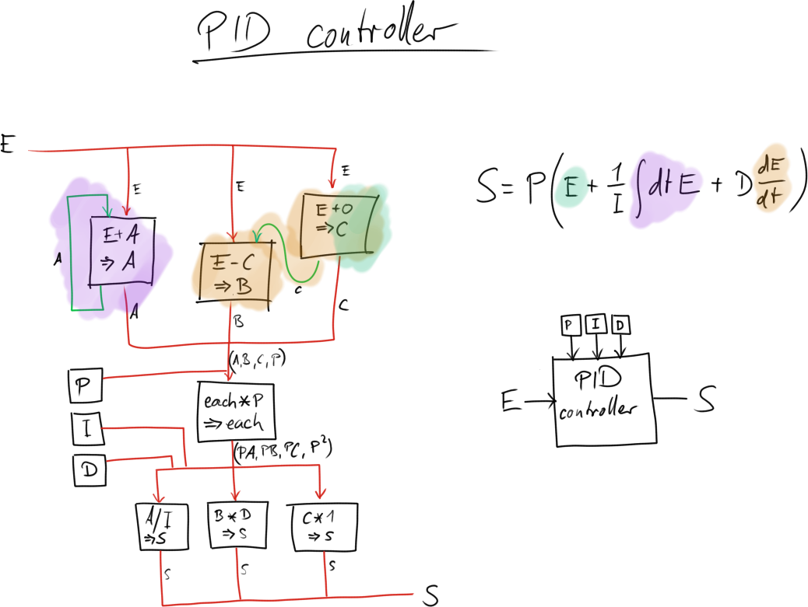

# PID controller

*TODO:* add rational coefficients for better numerics

## Controllers

The purpose of a controller is automatically tweaking the parameters of a system
so that it follows certain rules. For example, a stove has a controller that
enables and disables the heating elements in a way that the desired temperature
is reached as fast as possible, and then maintained relatively constant.

The simplest controller worth the name is known as a »Schmitt Trigger« or »Bang
Bang Controller«: if the desired quantity (stove heat) is below a threshold
enable the input (current to the heater), if it’s above a threshold disable it
again. This works well enough for many cases, but not so well for others.

  - Ramping up too heavily leads to overshooting the goal. This is particularly
    annoying in the heating setting, since cooling a stove takes *much* longer
    than heating it.
  - The quantity oscillates between on/off phases; ideally it should be
    constant.

The PID controller is a more sophisticated, but also much more powerful,
controller. Conceptually, it consists of three parts: a (P)roportional, an
(I)ntegral, and a (D)ifferential one. Each of these parts reads an input signal
E, which is usually a measure of how far off we are from the desired value (»E«
for »error«), and an output signal »S«. This signal is sent back to the system,
and the controller adjusts S such that E is minimized. Ideally, E is 0, meaning
the system does exactly what we want.

  - The proportional term reacts proportionally to the input error, nothing
    special about it.
  - The integral term sums up and remembers the errors made in the past; the
    longer the system is not in a desirable state, the larger the integral term
    grows.
  - The differential term extrapolates the error into the future, predicting how
    large the error is going to be based on its current slope.

## Factorio schematic

This is how one could build a PID controller in factorio out of just 7
arithmetic units:

  - The purple integral unit feeds back into itself, and is equivalent to a
    memory cell for the A signal. Each tick, it is altered by adding a value E
    to its internal state.

  - The orange differential unit has a 1-tick delay unit (»E+0 ⇒ C«) on the
    right hand side. The left cell then compares this delayed signal with the
    current one; the result is the change of E over the last tick, stored as B.

  - The teal proportional unit piggy-backs on part of the differential unit.
    This is theoretically unnecessary, since we might as well use E directly as
    C, but since both the integral and differential units have a 1-tick delay
    built in, this delay cell synchronizes A, B and C so that their value
    changes synchronously with E.

## Tuning the parameters P, I and D

A well-tuned PID controller is a very reliable controller. However, finding the
right parameters for P, I and D is not that easy. It is useful to keep the
following interpretations in mind:

  - I is the number of ticks we want the system to each E=0. If I is too large
    we’ll quickly reach but overshoot it, if it is too small it takes a long
    time to converge.
  - D describes how many ticks into the future we’re extrapolating. This is
    useful if we expect small fluctuations that we’d like to counteract. D too
    large means small fluctuations destabilize the system, D too small makes the
    system more stable, but makes it less adaptive to disturbances.
  - P is a constant that simply scales the output signal. Too small and the
    system will barely be controlled, too large and it might destabilize.

A good rule of thumb for tuning the parameters manually is to set all three to
zero. P is then increased until the output S oscillates noticably. Next, I is
increased so that the oscillation amplitude reduces by around a quarter each
period. If desired, D is increased until the system is satisfactorily quick in
reaching the steady state after a typical disturbance. Often, the parameter D is
left zero, since PI controllers are quite good on their own already, and not as
susceptible to instabilities due to spikes in the input signal E.

## Numerics

Factorio’s number system is integer-based, but a PID controller usually requires
fractional numbers in order to be able to tune a system nicely. Luckily, we can
emulate fractional numbers by scaling our integers up. The idea is that »if -5
to 5 is too coarse, multiply everything before by 100, run the system in the
range -500 to 500, and in the end shrink everything by a factor of 100 again.«

  - The input E should be somewhat large (in terms of its absolute value), in
    the range of up to many thousands or more. This way, division by the
    integral constant I has a meaningful effect. If all errors are below 10,
    then x/10 is zero, leading to an inactive integral term.

    A large E can be achieved by simply multiplying the actual input with a
    constant.

  - The output should be reasonably small, yet so fine-grained that it has a
    precise effect on the system it is supposed to control.

    When the output is too large, simply divide it by a constant P'.
    Mathematically, this means the *actual* PID parameter P is the P used in the
    circuit divided by that P'.

# Random number generation

## Linear Congruential Generator (LCG)

The linear congruential number generator is a very simple algorithm to produce
pseudorandom numbers. The simplicity comes at a price though, because the
numbers generated are of pretty poor quality, making it unsuitable for many
real-world applications. It is however very useful to generate »some noise« in
Factorio.

The LCG has two parameters `a` and `c` (carefully chosen) and a seed value
(arbitrary). A new random number Y is generated from the last one X by
calculating

    Y = a X + c   mod m

The parameter `m` is 2^32 in Factorio, since we’ll be using its built-in 32-bit
wrapping integer overflow arithmetic. The constants `a` and `c` need to satisfy
some properties to make the output random; luckily, good values can be looked up
on the internet. We’ll be using

    a = 214013
    c = 2531011

since they’re relatively short to type in. [Wikipedia has a list of alternative
choices.](https://en.wikipedia.org/wiki/Linear_congruential_generator)

### Truncation of predictable digits

We can now generate lots of numbers using the formula; unfortunately, the less
significant the bit, the less random it is due to LCG’s properties. For our
(already ideal) choice of parameters, the i-th least significant bit has a
period length of at most 2^i, which is quite terrible for a random number
generator. Basically, the red parts of our output are not random at all,

We now have to take away as many digits on the right as possible, leaving us
with good random numbers. We can do this by dividing by 2^n, where n is the
number of bits to discard. Good choices are

  - n=31: we get a pretty good RNG for a true/false value.
  - n=16: there are 65536 possible outcomes (ranging from -2^15+1 to 2^15);
    probably more than enough for Factorio.

### Circuit schematic

Putting both the generator and the truncator in Factorio gives us

where the left part is our raw generator with feedback loop, and the right one
truncates the not very random least significant n bit. And simple enough, in
the game it looks like this:

